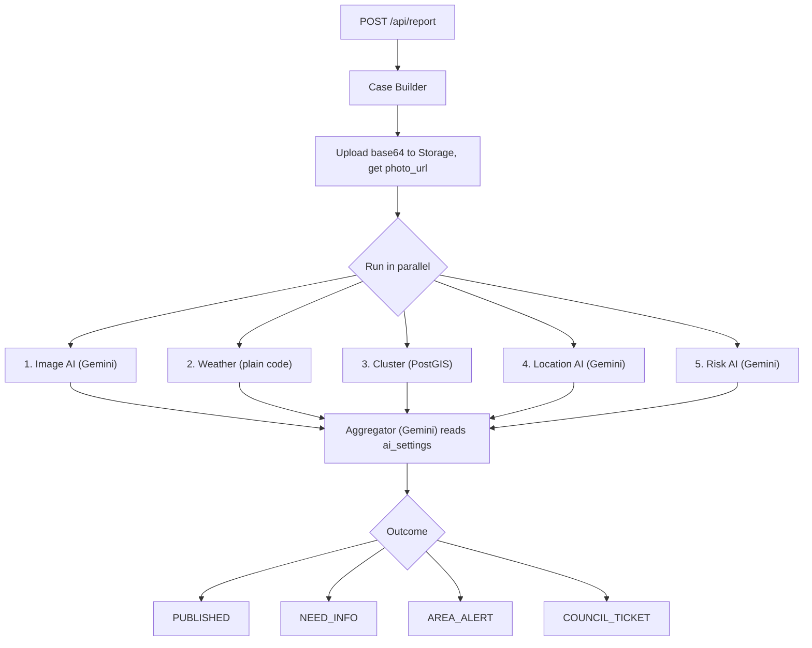

# Colombo Flood & Hazard Response Platform

CodeArena'26 · Topic 04 · Disaster Response · 36-hour build.

Build to the locked spec: a Next.js API-only backend on Vercel running the 5-check + aggregator pipeline against Supabase/PostGIS with Gemini, plus one Expo SDK 57 app with a role picker into Citizen, Officer, Field Crew, and Relief Desk screens.

Sequenced to de-risk the EAS Android build in the first hour, and to protect a demo-critical spine if time runs short.

## Current state

Workspace starts empty. Node v24.11.1 and npm 11.6.2 are installed, which satisfies Expo SDK 57's minimum of Node 22.13.

Remote: [https://github.com/batman2400/disaster_response_app](https://github.com/batman2400/disaster_response_app)

## Stack versions (confirmed)

- Expo SDK 57 (React Native 0.86, React 19.2.3). `react-native-maps` 1.27.2 is the bundled version.
- Expo Go on Android SDK 57 ships an **expired** Google Maps API key, so maps render blank. An EAS dev build with our own Maps key is required, not optional. This is why it goes first.
- `@google/genai` with `config.responseMimeType: "application/json"` + `responseSchema` to force structured check output, and `inlineData: { mimeType, data }` for the photo (base64 **without** the `data:image/jpeg;base64,` prefix).

## Repo layout

```
backend/          Next.js App Router, API routes only
disaster-mobile/  Expo SDK 57 app, all four roles
supabase/         schema.sql, policies.sql, seed.sql
scripts/          rainy-day replay, mock report seeder
```

---

## Demo-critical spine

These are the five must-work items from the brief. Everything in this list is protected; nothing below the trim line gets started until all five pass a live demo run.

1. Citizen reports a hazard with photo + GPS
2. Mocked weather/river feed raises area warnings on its own
3. Weather + cluster run as plain code; image + location run as AI
4. A confirmed flood triggers an area alert
5. Crew closes a hazard with a photo, public map updates

**Trim line.** Below it, in the order they get dropped if time runs out:

- Officer map pins and ward telemetry polish
- NEED_INFO crowdsource quorum UI (reduced to a single confirm button that increments `confirmations_count`)
- Safe routes rendered as static polylines rather than computed
- Relief Desk screen — trimmed *last* because it is one of the four required roles, but it is a plain filter/sort list and the cheapest screen to build at the end

The stretch goal (detour routing, nearest-shelter-with-space routing) stays untouched until every spine item works.

---

## Build checklist

### Phase 0 — EAS de-risk (first)

- [ ] Expo account, `eas-cli` login, Google Maps SDK for Android key
- [ ] Scaffold a bare Expo SDK 57 app with one `MapView`, wire the `react-native-maps` config plugin
- [ ] `eas build:configure` and fire an Android development build
- [ ] Confirm on a physical device that map tiles actually render

### Phase 1 — Database (while EAS is queued)

- [ ] `supabase/schema.sql` (spec schema plus `hazards_set_location` trigger and explicit `::geography` cast in `check_cluster`)
- [ ] `supabase/policies.sql` (anon SELECT grants, RLS, `supabase_realtime` publication)
- [ ] `supabase/seed.sql` (three wards plus shelters)
- [ ] Verify `check_cluster` returns rows for two points 150m apart

### Phase 2 — Report pipeline (MOCK_AI)

- [ ] Next.js App Router backend with `@supabase/supabase-js` and `@google/genai`
- [ ] `lib/gemini.ts` with `responseSchema` + `MOCK_AI` fixture mode
- [ ] Five checks + aggregator, stubbed Gemini JSON shapes
- [ ] `POST /api/report` returns the locked response contract — curl only, no UI

### Phase 3 — Override and resolve

- [ ] `POST /api/override` — status update, officer note, clamped `ai_settings` nudge
- [ ] `POST /api/resolve` — closure photo upload, `is_road_blocked = false`, `status = RESOLVED`

### Phase 4 — Live credentials, Gemini, deploy

- [ ] Supabase project (URL, anon key, service role key, public `hazard-photos` bucket)
- [ ] Gemini API key; pin a confirmed model id into `GEMINI_MODEL`
- [ ] Wire real Gemini calls with deterministic fallback on error/timeout
- [x] Deploy to Vercel; confirm endpoints work from the phone's network

### Phase 5 — Expo spine screens

- [ ] Role picker + navigation to all five screens
- [ ] **SPINE** Citizen Report + Public Map (realtime pins)
- [ ] **SPINE** Officer ticket queue + override button
- [ ] **SPINE** Field Crew closure with after-fix photo

### Phase 6 — Weather replay

- [ ] **SPINE** `scripts/replay-rainy-day.ts` drives NORMAL → WATCH → CRITICAL with no user action
- [ ] `scripts/mock-reports.ts` seeds clustered reports and mock photos

### Freeze, then trim

- [ ] Run the five must-work requirements as a scripted demo pass, fix, freeze, pitch notes — **before** starting the trim tier
- [ ] **TRIM** Relief Desk screen
- [ ] **TRIM** Officer map pins, ward telemetry, NEED_INFO confirm, static safe-route polylines

---

## Phase 0 — EAS de-risk (first, before any other code)

An EAS build needs an app to exist, so this phase scaffolds the minimum that can be built, then fires the build and leaves it in the queue. The 20 to 40 minutes of queue and build time is when Phases 1 through 3 get written, so this ordering buys de-risking *and* parallelism.

What you do:

1. Create an Expo account, then `npm i -g eas-cli` and `eas login`.
2. Google Cloud Console: enable **Maps SDK for Android**, create an API key.

What the build does:

1. `npx create-expo-app@latest disaster-mobile` on SDK 57, add `react-native-maps`.
2. Register the config plugin with the Maps key — this is the step that makes tiles load:

```json
"plugins": [
  ["react-native-maps", { "androidGoogleMapsApiKey": "YOUR_KEY" }]
]
```

3. One throwaway screen with `<MapView provider={PROVIDER_GOOGLE} />` centred on Colombo.
4. `eas build:configure`, then `eas build --profile development --platform android`.

**Exit gate:** the dev build installs on a physical Android device and shows real map tiles, not a grey grid with a watermark. If this fails we find out in hour 1, not hour 30.

---

## Phase 1 — Database (written while the EAS build is queued)

`supabase/schema.sql` uses the spec schema verbatim except for two changes, both of which fix real breakage.

**Fix 1 — `location` is never populated.** The spec's `hazards` table has a `location GEOMETRY(Point, 4326)` column but the insert payload only carries `lat`/`lng`. Nothing writes `location`, so the GIST index stays empty and `check_cluster()` returns zero rows forever — the cluster check would silently always fail, and we would not notice until the demo. A trigger fixes it and keeps the API insert simple:

```sql
CREATE OR REPLACE FUNCTION hazards_set_location() RETURNS TRIGGER AS $$
BEGIN
  NEW.location := ST_SetSRID(ST_MakePoint(NEW.lng, NEW.lat), 4326);
  RETURN NEW;
END;
$$ LANGUAGE plpgsql;

CREATE TRIGGER trg_hazards_set_location
  BEFORE INSERT OR UPDATE OF lat, lng ON hazards
  FOR EACH ROW EXECUTE FUNCTION hazards_set_location();
```

**Fix 2 — mixed geometry/geography in `check_cluster`.** The spec compares a `geometry` column against a `::geography` literal. Relying on PostGIS's implicit cast is fragile and can make `radius_meters` be interpreted in degrees instead of metres. Cast both sides explicitly so 200 means 200 metres:

```sql
WHERE ST_DWithin(
  location::geography,
  ST_SetSRID(ST_MakePoint(report_lng, report_lat), 4326)::geography,
  radius_meters
)
```

`supabase/policies.sql` — the app subscribes to Supabase realtime directly with the anon key, which needs explicit setup the spec does not mention. Without the publication line, realtime silently delivers nothing even though the subscription reports `SUBSCRIBED`:

```sql
GRANT SELECT ON public.hazards, public.wards, public.shelters TO anon;
ALTER TABLE hazards ENABLE ROW LEVEL SECURITY;
CREATE POLICY "anon read hazards" ON hazards FOR SELECT TO anon USING (true);
ALTER PUBLICATION supabase_realtime ADD TABLE hazards, wards, shelters;
```

Writes stay server-only through the service role key. `supabase/seed.sql` carries the three wards from the spec plus shelters with capacity across those wards.

**Exit gate:** `check_cluster()` returns 2 rows for two seeded points 150m apart, and 0 for a point 5km away.

---

## Phase 2 — `POST /api/report` (the core, spec Sections 4 and 6)

Built entirely against `MOCK_AI=1` fixtures first, so it is complete and curl-tested before any Gemini key exists.



Files:

- `backend/lib/supabase.ts` — service-role client.
- `backend/lib/gemini.ts` — one `callGemini(prompt, schema, imageBase64?)` helper using `responseSchema`. Honours `MOCK_AI=1` to return fixtures.
- `backend/lib/checks/image.ts`, `weather.ts`, `cluster.ts`, `location.ts`, `risk.ts` — one file per check, exactly the five definitions in Section 4. Weather is the plain expression `rainfall_mm > 40.0 || river_level_pct > 75.0`; cluster calls the RPC and tests `count >= 2` within 200m over 3 hours.
- `backend/lib/aggregator.ts` — single Gemini call, reads current `ai_settings` thresholds, returns `confidence_score`, `reasoning`, and one of the four outcomes.
- `backend/app/api/report/route.ts` — returns the locked response shape from Section 6 exactly.

The three independent AI checks run concurrently via `Promise.all`, then the aggregator runs, so a report costs roughly two round trips of latency rather than four.

---

## Phase 3 — `POST /api/override` and `POST /api/resolve`

- `override` sets the hazard status, records `officer_note`, and nudges `ai_settings` — confirming a rejected case lowers `confirm_threshold`, rejecting a published case raises it. Nudges are clamped to a sane band so a few demo taps cannot drive thresholds to 0 or 1. This is the entire retuning loop.
- `resolve` accepts `closure_photo_base64`, uploads it, and sets `is_road_blocked = FALSE`, `status = 'RESOLVED'`, `resolved_at = NOW()`. Realtime pushes the change to every open map.

---

## Phase 4 — Remaining credentials, live Gemini, deploy

Now that the pipeline is written and curl-tested, plug in the real services:

1. **Supabase project** (region Singapore for latency to Colombo) — `NEXT_PUBLIC_SUPABASE_URL`, `SUPABASE_SERVICE_ROLE_KEY`, anon key for the app, plus a public Storage bucket `hazard-photos`. Apply Phase 1 SQL.
2. **Gemini API key** from Google AI Studio. Run `models.list` against the key and pin a confirmed flash model into `GEMINI_MODEL` rather than hardcoding a model name that may not exist on the account.
3. Flip `MOCK_AI` off, add deterministic fallback on Gemini error or timeout so a flaky network cannot break the demo.
4. Deploy to Vercel, then confirm the endpoints respond from the phone's own network.

---

## Phase 5 — Expo app, spine screens first

Grow the Phase 0 scaffold using expo-router, since role-based routing is what file-based routing handles well:

- `app/index.tsx` — role picker, writes role to context, no auth.
- `app/citizen/report.tsx` — the demo centrepiece: photo, GPS, category, verdict with reasoning and check breakdown.
- `app/citizen/map.tsx` — `PROVIDER_GOOGLE` pins coloured by status and urgency, realtime subscription, area alert banner.
- `app/officer/index.tsx` — ticket queue with status badges and the override button. Map pins and ward telemetry are below the trim line.
- `app/crew/index.tsx` — assigned tickets, camera-required closure.
- `app/relief/index.tsx` — below the trim line, built last.

---

## Phase 6 — Second way in: weather replay

`scripts/replay-rainy-day.ts` replays a past Colombo rainy day as timestamped `rainfall_mm` / `river_level_pct` ticks, updating `wards` on an interval and flipping `status` through NORMAL, WATCH, CRITICAL. Because wards are in the realtime publication, ward telemetry and area warnings change in the app with nobody touching it, which is the "raises area warnings on its own" requirement. `scripts/mock-reports.ts` seeds clustered reports so the cluster check has something real to find on demo day.

---

## Out of scope

No dashboard pages, no real auth, no model retraining. Detour routing and nearest-shelter routing are the stretch goal and stay untouched until every spine item works end to end.
