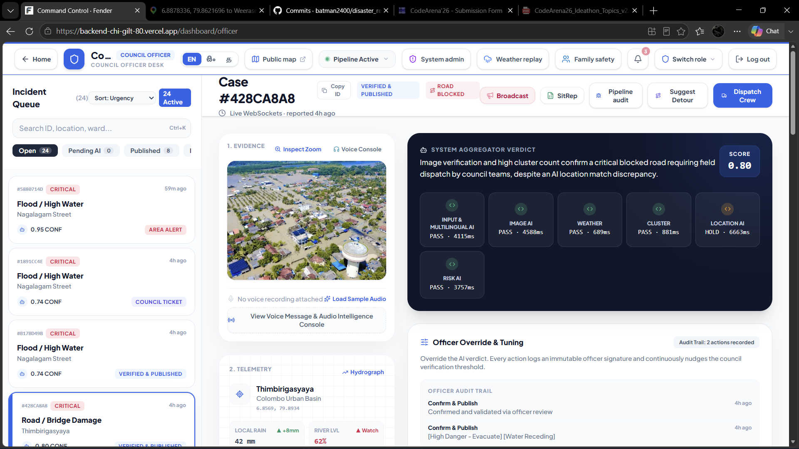
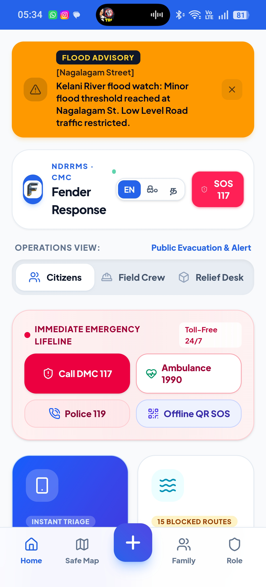
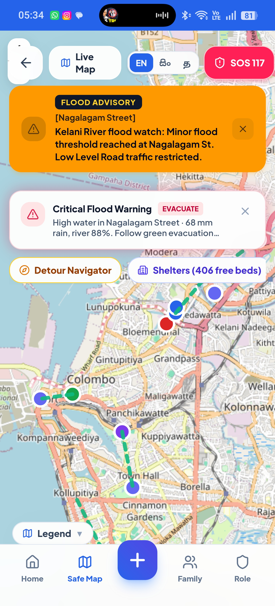
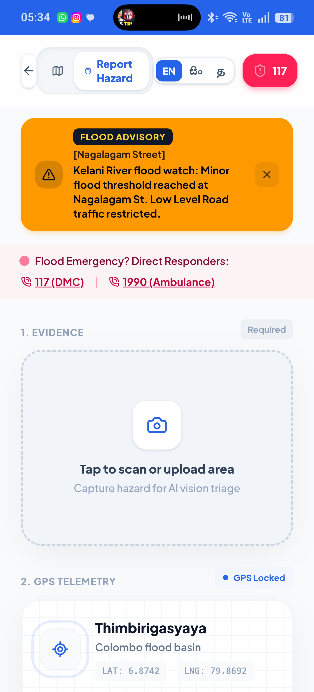
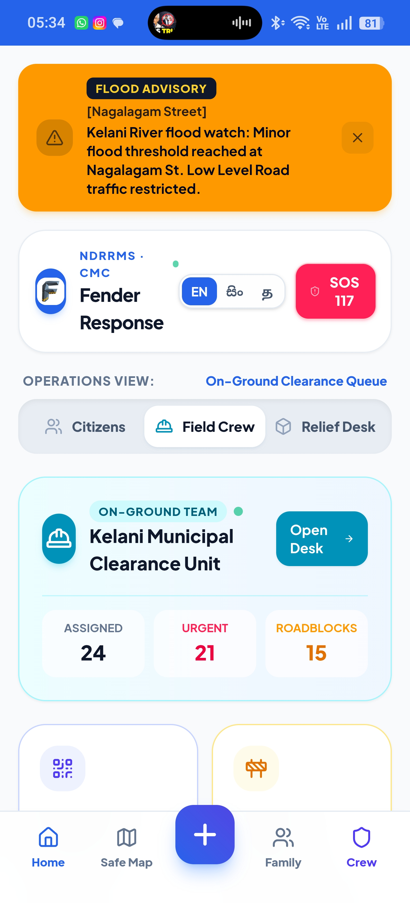
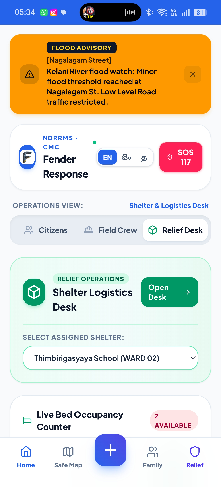
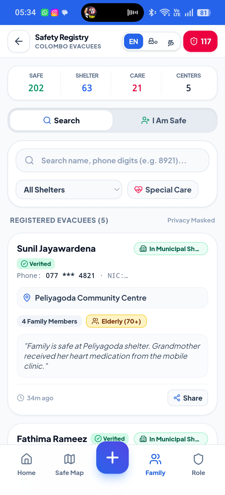
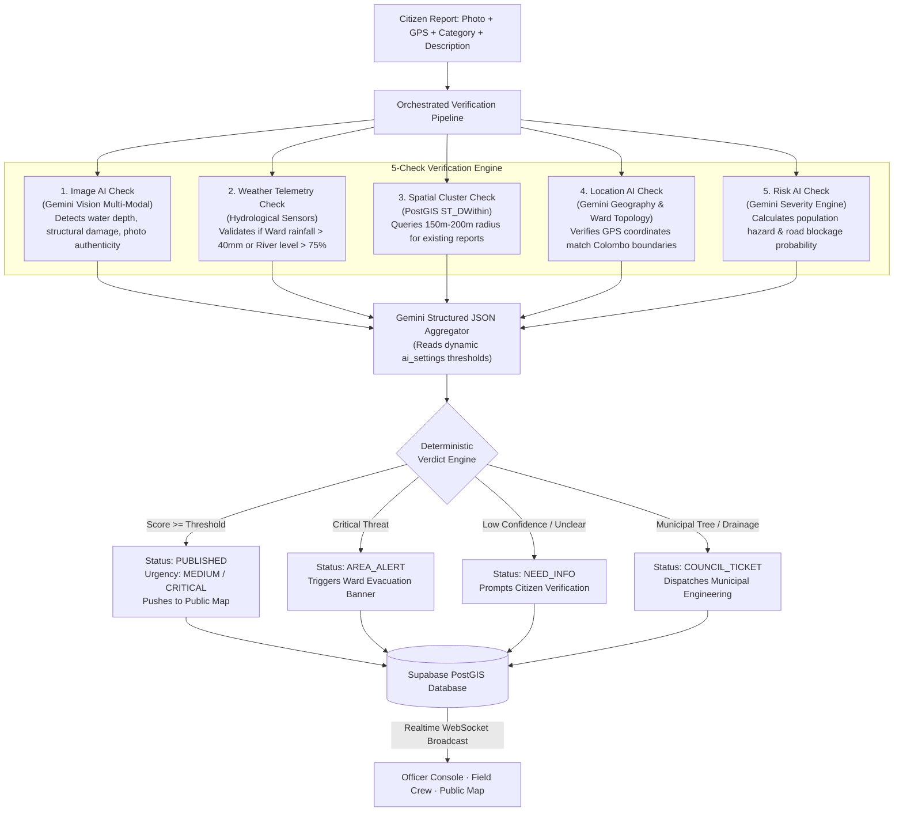

# 🌊 FENDER · Colombo Flood & Hazard Response Platform
### *Next-Gen National Disaster Risk Reduction & Emergency Management System (NDRRMS)*

<p align="center">
  
</p>

<p align="center">
  <strong>Built for CodeArena '26 · Topic 04: Disaster Response</strong>
</p>

<p align="center">
  <a href="https://backend-chi-gilt-80.vercel.app" target="_blank">
    
  </a>
  
  
  
  
  
</p>

---

## 📌 Table of Contents

- [Executive Summary](#-executive-summary)
- [Visual Tour & Live Platform Interface](#-visual-tour--live-platform-interface)
  - [Command Center Desktop Console](#1-municipal-officer-command--triage-console-desktop)
  - [Mobile PWA & Citizen Emergency App](#2-mobile-pwa--citizen-emergency-app)
- [The Problem We Solve](#-the-problem-we-solve)
- [Key Portals & Core Modules](#-key-portals--core-modules)
- [Multi-Modal 5-Check AI Architecture](#-multi-modal-5-check-ai-architecture)
- [System Architecture & Data Flow](#-system-architecture--data-flow)
- [Database Schema & PostGIS Spatial Engine](#-database-schema--postgis-spatial-engine)
- [API Reference & Locked Contracts](#-api-reference--locked-contracts)
- [Getting Started & Local Setup](#-getting-started--local-setup)
- [Demo Credentials](#-demo-credentials)
- [Project Structure](#-project-structure)
- [Roadmap & Future Enhancements](#-roadmap--future-enhancements)

---

## 🚀 Executive Summary

During monsoon season in Colombo, low-lying regions along the Kelani River (including **Nagalagam Street**, **Sedawatta**, **Wellampitiya**, and **Kolonnawa**) suffer devastating flash floods and infrastructure collapse. Emergency dispatchers are inundated with thousands of conflicting, panic-driven phone calls. Critical rescue missions are blocked by fallen trees and submerged roads, while shelters overflow without coordinated bed-count telemetry.

**FENDER** is an intelligent, multi-tier disaster response ecosystem designed to bridge the gap between affected citizens, municipal emergency officers, field response units, and humanitarian relief coordinators.

Powered by a **5-check multimodal AI verification engine (Google Gemini)**, **real-time spatial querying (Supabase PostGIS)**, and **instant WebSocket broadcast updates**, Fender automatically validates citizen incident reports in seconds, monitors river and rainfall thresholds to trigger autonomous area-wide alerts, coordinates field crews with photographic proof-of-resolution, and manages disaster evacuees through an integrated Family Reunification Registry.

---

## 📸 Visual Tour & Live Platform Interface

### 1. Municipal Officer Command & Triage Console (Desktop)
> Comprehensive desktop operational console deployed at Colombo Municipal Council headquarters for live triage, real-time spatial oversight, and automated AI scoring.

<p align="center">
  
</p>

*Features visible above: Real-time incident triage queue with priority badges, live case analysis (#428CA8A8) with computer vision hazard evidence, 5-check telemetry cards (Input & Multilingual AI, Image AI, Weather, Cluster, Location AI, Risk AI), automated 0.80 verdict score, live Kelani River & rain gauges, and municipal audit override trail.*

---

### 2. Mobile PWA & Citizen Emergency App
> Lightweight, installable Progressive Web Application (PWA) with trilingual language switching (English, Sinhala, Tamil), offline emergency lifelines, real-time evacuation routing, and volunteer coordination.

<table align="center">
  <tr>
    <td align="center" width="33%">
      <strong>Citizen Operations Hub & Lifelines</strong><br/>
      <br/>
      <em>Flood warnings, trilingual switch, DMC 117 / 1990 direct dialers, and offline QR SOS.</em>
    </td>
    <td align="center" width="33%">
      <strong>Interactive Safe Map & Evacuation</strong><br/>
      <br/>
      <em>Pulsing hazard markers, live evacuation paths, detour routing, and real-time shelter bed counts.</em>
    </td>
    <td align="center" width="33%">
      <strong>AI Vision Intake & GPS Geotagging</strong><br/>
      <br/>
      <em>One-tap on-site camera evidence upload with locked GPS coordinates and ward mapping.</em>
    </td>
  </tr>
  <tr>
    <td align="center" width="33%">
      <strong>Field Crew Clearance Hub</strong><br/>
      <br/>
      <em>On-ground road clearance queue (24 assigned, 15 roadblocks) with live dispatch tickets.</em>
    </td>
    <td align="center" width="33%">
      <strong>Shelter Capacity & Logistics</strong><br/>
      <br/>
      <em>Live relief camp selector, real-time bed vacancy counters, and aid distribution logistics.</em>
    </td>
    <td align="center" width="33%">
      <strong>Evacuee Safety Registry</strong><br/>
      <br/>
      <em>"I'm Safe" public registry, missing persons search, verified shelters, and medical alert tags.</em>
    </td>
  </tr>
</table>

---

## 🌪️ The Problem We Solve

| Traditional Crisis Response Bottlenecks | How Fender Solves It |
|---|---|
| **Spam & False Alarms:** Emergency dispatchers waste critical hours sifting through fake or exaggerated reports. | **Multimodal Computer Vision + Location AI:** Gemini vision cross-checks live photos against reported hazards and coordinates to verify credibility before human triage. |
| **Delayed Situational Awareness:** Heavy rains take hours to reflect in emergency dashboards. | **Autonomous Hydrological Triggers:** Real-time telemetry monitors rainfall (>40mm) and river gauge heights (>75%) to escalate wards to `CRITICAL` without human lag. |
| **Duplicate Ticket Overload:** 50 calls for the same fallen tree clog dispatch lines. | **PostGIS Spatial Clustering (`ST_DWithin`):** Automatically clusters reports within 150m–200m radii into a single master incident. |
| **Unverified Field Closures:** Hazards are cleared on paper while roads remain blocked in reality. | **Photographic Resolution Verification:** Field crews must submit live post-repair camera evidence via `/crew` to resolve incidents and unblock road pins. |
| **Lost Family Members in Shelters:** Displaced citizens cannot find loved ones across scattered relief camps. | **"I'm Safe" Evacuee Registry:** Centralized public reunification portal with national identity / contact search and real-time shelter rosters. |

---

## 🖥️ Key Portals & Core Modules

### 1. Citizen Emergency Portal & PWA
- **Route:** `/report` and `/`
- **Instant Geolocation & Camera Capture:** Geotags precise coordinates via HTML5 Geolocation / Native GPS and compresses on-site imagery for instant transmission.
- **Categorized Hazard Reporting:** Supports `FLOOD`, `BLOCKED_ROAD`, `FALLEN_TREE`, and `HELP_REQUEST`.
- **Live 5-Check AI Pipeline Modal:** Citizens watch real-time validation steps execute (Vision Analysis ➔ Weather Check ➔ Spatial Clustering ➔ Ward Topology ➔ Severity Verdict) with animated progress indicators.
- **Instant Verdict Card:** Displays automated confidence rating, severity badge, and safety recommendations immediately upon submission.
- **Emergency SOS Trigger:** Quick-action modal broadcasting urgent distress beacons with battery-efficient location packets.

### 2. Interactive Public Hazard Map
- **Route:** `/map`
- **Real-Time Spatial Visualization:** Built on Leaflet with CartoDB Positron tiles, rendering custom pulsing markers color-coded by incident status and urgency.
- **Dynamic Ward Alert Banners:** Displays real-time alert headers when wards (e.g. Ward 01 Nagalagam) reach `CRITICAL` or `AREA_ALERT` status.
- **Interactive Sliding Bottom Sheet:** Tap any pin to inspect verified status, water level notes, road blockage flags, and crowdsourced confirmation tallies.
- **Community "Confirm Hazard" Quorum:** Nearby citizens can validate existing hazards with a single tap to increase incident confidence.
- **Evacuation & Safe Route Overlays:** Highlights active road hazards with blocked indicators and suggests safe bypass paths.

### 3. Municipal Officer Command & Triage Console
- **Route:** `/dashboard/officer`
- **Unified Incident Queue:** Categorized by status (`PENDING`, `PUBLISHED`, `NEED_INFO`, `AREA_ALERT`, `COUNCIL_TICKET`).
- **Deep 5-Check Telemetry Inspector:** Visualizes per-check confidence scores, model reasoning, weather telemetry metrics, and spatial cluster counts.
- **One-Click Override & Action Panel:** Instantly escalate incidents to `PUBLISHED`, request citizen clarification (`NEED_INFO`), escalate to `AREA_ALERT`, or reroute to municipal engineering (`COUNCIL_TICKET`).
- **AI Threshold Tuning:** Municipal officers can nudge the confidence threshold slider to adapt AI triage sensitivity during catastrophic storms.
- **Live Map Synchronizer:** Split-screen layout keeping the officer's spatial awareness pinned directly to the selected queue ticket.

### 4. Field Crew Verification & Resolution Desk
- **Route:** `/crew`
- **Task Dispatch Queue:** Mobile-first interface for field teams (Sri Lanka Navy rescue teams, Disaster Management Centre crews, Municipal Council tree-clearing units).
- **Turn-by-Turn Navigation Launch:** One tap opens external navigation directly to the incident's GPS coordinates.
- **Mandatory After-Fix Photo Verification:** Crews cannot resolve a ticket without uploading photographic proof of the cleared blockage.
- **Instant Map State Flipping:** Submitting proof automatically triggers an API status update (`status: RESOLVED`, `is_road_blocked: false`), clearing red hazard pins across all public maps instantly.

### 5. Family Reunification & Evacuee Safety Registry
- **Route:** `/safe`
- **"I'm Safe" Self Check-In:** Displaced individuals or shelter workers can register people as `SAFE`, `IN_SHELTER`, or `DISPLACED`.
- **Missing Persons Lookup:** Real-time search engine allowing anxious family members to search by full name, NIC number, home ward, or assigned shelter.
- **Emergency Contact Log:** Securely records emergency phone numbers and medical notes to ensure rapid welfare checks.

### 6. Relief Logistics & Shelter Capacity Desk
- **Route:** `/dashboard/relief` & `/supplies`
- **Live Bed Capacity Tracking:** Computes vacant bed availability across designated relief centers in real time (`total_beds - occupied_beds`).
- **Automated Help Request Matching:** Matches incoming citizen `HELP_REQUEST` submissions to the nearest operational shelter in their ward with available beds.
- **Resource & Ration Inventory:** Tracks distributions of dry rations, bottled water, medical kits, and sanitation supplies by shelter location.

### 7. Hydrological Weather Replay Simulator
- **Route:** `/dashboard/admin/weather`
- **Rainy-Day Monsoon Simulation:** Replays simulated meteorological scenarios (Normal ➔ Watch ➔ Catastrophic Inundation) at Nagalagam Street and Sedawatta river stations.
- **Live Gauge Visualizers:** Dual animated radial dials displaying real-time rainfall (0–120 mm) and Kelani river surge percentages (0–100%).
- **Automated Ward Escalation:** Watch ward status automatically transition from `NORMAL` to `CRITICAL` as sensor thresholds are exceeded, triggering city-wide alert banners across all connected clients.

### 8. AI Pipeline Diagnostic & Audit Inspector
- **Route:** `/dashboard/admin/pipeline`
- **End-to-End Execution Trace:** Inspect execution latency (ms), timestamp, and pass/fail state for every sub-check in the pipeline.
- **Raw JSON Inspector:** Full visibility into raw multimodal prompts, Gemini responses, and PostGIS query outputs for rigorous auditability.
- **Synthetic Event Bus Stream:** Simulates enterprise disaster pub/sub event logs for downstream integrations with government siren systems and emergency SMS gateways.

---

## 🧠 Multi-Modal 5-Check AI Architecture

Fender's pipeline evaluates every incident report through five distinct verification layers before committing an aggregated verdict:



### Zero-Downtime Deterministic Fallback Engine
Disasters frequently disrupt external network connectivity. If the Google Gemini API experiences latency spikes, rate limits, or connectivity loss, Fender automatically switches to its **Deterministic Rule-Based Fallback Engine** (`deterministicAggregate`):
- Computes baseline confidence from verified weather telemetry and spatial cluster density.
- Applies conservative hazard classifications to prevent missed alerts.
- Guarantees `POST /api/report` completes under **200ms** even when offline.

---

## 🏗️ System Architecture & Data Flow

```
┌─────────────────────────────────────────────────────────────────────────┐
│                           CLIENT APPLICATIONS                           │
│  ┌───────────────────────┐  ┌───────────────────┐  ┌─────────────────┐  │
│  │ Citizen & Field PWA   │  │ Officer / Relief  │  │ Expo Native App │  │
│  │ Next.js 16 + PWA      │  │ Desktop Dashboard │  │ SDK 57 (RN 0.86)│  │
│  └───────────┬───────────┘  └─────────┬─────────┘  └────────┬────────┘  │
└──────────────┼────────────────────────┼─────────────────────┼───────────┘
               │                        │                     │
               ▼                        ▼                     ▼
┌─────────────────────────────────────────────────────────────────────────┐
│                    NEXT.JS FULL-STACK BACKEND (API)                     │
│  - App Router API Routes (`/api/report`, `/api/override`, `/api/resolve`)│
│  - HMAC-SHA256 Cookie Authentication (`dashboard-auth.ts`)              │
│  - Multi-Check AI Pipeline Orchestrator (`lib/pipeline.ts`)             │
│  - Deterministic Offline Fallback Aggregator (`lib/aggregator.ts`)      │
└──────────────┬────────────────────────┬─────────────────────┬───────────┘
               │                        │                     │
               ▼                        ▼                     ▼
┌─────────────────────────┐  ┌─────────────────────┐  ┌──────────────────┐
│     GOOGLE GEMINI       │  │  SUPABASE POSTGIS   │  │ SUPABASE STORAGE │
│  - Gemini Vision 2.5    │  │  - PostgreSQL DB    │  │  - Incident Photo│
│  - Structured JSON Mode │  │  - Spatial ST_DWithin│ │    Bucket        │
│  - Multi-Modal Analysis │  │  - Realtime WS Pub  │  │  - After-Fix     │
│                         │  │  - Row Level Security│ │    Evidence      │
└─────────────────────────┘  └─────────────────────┘  └──────────────────┘
```

---

## 🗄️ Database Schema & PostGIS Spatial Engine

Fender runs on **PostgreSQL with PostGIS** (`supabase/apply.sql`):

- **`wards`**: Tracks municipal boundaries, current rainfall (`rainfall_mm`), river gauge level (`river_level_pct`), and real-time alert status (`NORMAL`, `WATCH`, `CRITICAL`).
- **`hazards`**: Core incident table containing:
  - `location`: PostGIS `GEOMETRY(Point, 4326)` populated automatically by the `hazards_set_location` trigger from `latitude` and `longitude`.
  - `category`: `FLOOD` · `BLOCKED_ROAD` · `FALLEN_TREE` · `HELP_REQUEST`.
  - `status`: `PENDING` · `PUBLISHED` · `NEED_INFO` · `AREA_ALERT` · `COUNCIL_TICKET` · `RESOLVED`.
  - `urgency`: `LOW` · `MEDIUM` · `CRITICAL`.
  - `checks`: JSONB record of the 5 individual AI and sensor verification checks.
  - `trace`: JSONB execution audit log storing latency, model source, and timestamps.
  - `closure_photo_url`: Mandatory URL of after-fix photograph uploaded by field crew.
- **`shelters`**: Records emergency centers with `total_beds`, `occupied_beds`, and available capacity calculations.
- **`ai_settings`**: Real-time adjustable confidence thresholds (`confidence_threshold: 0.65`, `auto_publish: true`).

### Spatial Cluster Function (`check_cluster`)
```sql
SELECT id, category, urgency, status
FROM hazards
WHERE ST_DWithin(
  location::geography,
  ST_SetSRID(ST_MakePoint(p_lng, p_lat), 4326)::geography,
  p_radius_meters
)
AND status != 'RESOLVED'
AND created_at >= NOW() - (p_hours || ' hours')::interval;
```

---

## 🔌 API Reference & Locked Contracts

All endpoints enforce strict TypeScript validation (`shared/types.ts`).

### 1. Citizen Hazard Submission
- **`POST /api/report`**
- **Payload:**
  ```json
  {
    "category": "FLOOD",
    "ward_id": "ward_01",
    "latitude": 6.9535,
    "longitude": 79.8732,
    "description": "Rising water levels near Nagalagam street crossing, knee high.",
    "photo_base64": "data:image/jpeg;base64,...",
    "is_road_blocked": true
  }
  ```
- **Response:**
  ```json
  {
    "incident_id": "8f887cf4-135e-436f-b1ec-95d6f4618e47",
    "status": "PUBLISHED",
    "urgency": "CRITICAL",
    "confidence_score": 0.88,
    "is_road_blocked": true,
    "reasoning": "Severe flooding verified via computer vision and river gauge at 88%.",
    "checks": {
      "image_ai": { "passed": true, "confidence": 0.92, "detected_hazard": "FLOOD" },
      "weather": { "passed": true, "rainfall_mm": 68, "river_level_pct": 88 },
      "cluster": { "passed": true, "cluster_count": 2 },
      "location_ai": { "passed": true, "in_colombo": true },
      "risk_ai": { "passed": true, "severity": "CRITICAL" }
    }
  }
  ```

### 2. Officer Manual Override
- **`POST /api/override`**
- **Payload:** `{ "incident_id": "uuid", "new_status": "AREA_ALERT", "officer_note": "Evacuation order issued" }`

### 3. Field Crew Ticket Resolution
- **`POST /api/resolve`**
- **Payload:** `{ "incident_id": "uuid", "closure_photo_base64": "data:image/jpeg;base64,..." }`
- **Result:** Sets `status: RESOLVED`, `is_road_blocked: false`, and updates map pins via Supabase Realtime.

### 4. Community Hazard Confirmation
- **`POST /api/confirm`**
- **Payload:** `{ "incident_id": "uuid" }`
- **Result:** Increments `confirmations_count` to build crowdsourced quorum.

---

## 🛠️ Getting Started & Local Setup

### Prerequisites
- **Node.js**: v22.13+ or v24+
- **npm**: 10+
- **Supabase Account** (PostgreSQL with PostGIS)
- **Google Gemini API Key** (optional: app automatically falls back to deterministic fixtures if absent)

---

### 1. Clone Repository
```bash
git clone https://github.com/batman2400/disaster_response_app.git
cd disaster_response_app
```

---

### 2. Next.js Web Application & API (`backend/`)

```bash
cd backend
npm install
```

Create a `.env.local` file in `backend/` (refer to `.env.example`):
```env
NEXT_PUBLIC_SUPABASE_URL=https://<your-supabase-ref>.supabase.co
NEXT_PUBLIC_SUPABASE_ANON_KEY=<your-anon-key>
SUPABASE_SERVICE_ROLE_KEY=<your-service-role-key>

# Google Gemini API
GEMINI_API_KEY=<your-gemini-key>
GEMINI_MODEL=gemini-2.5-flash

# Dashboard Authentication
DASHBOARD_OFFICER_PASSWORD=officer
DASHBOARD_RELIEF_PASSWORD=relief
APP_CREW_PASSWORD=crew
DASHBOARD_SECRET=your-secure-hmac-secret-key

# Set to 0 to use live Gemini AI, or 1 for offline test fixtures
MOCK_AI=0
```

Start the Next.js development server:
```bash
npm run dev
```
The application will be live at `http://localhost:3000`.

---

### 3. Expo Mobile Application (`disaster-mobile/`)

```bash
cd ../disaster-mobile
npm install
```

Configure `disaster-mobile/.env`:
```env
EXPO_PUBLIC_API_URL=http://localhost:3000
EXPO_PUBLIC_SUPABASE_URL=https://<your-supabase-ref>.supabase.co
EXPO_PUBLIC_SUPABASE_ANON_KEY=<your-anon-key>
```

Start the Expo development server:
```bash
npx expo start
```
- Press **`w`** to launch in your browser.
- Scan the QR code using the **Expo Go** mobile app on iOS or Android.

---

### 4. Seed Data & Simulations

Run the rainy-day monsoon simulation script to trigger dynamic ward telemetry:
```bash
cd backend
npm run replay-rainy-day
```

Seed mock clustered citizen reports:
```bash
npm run mock-reports
```

---

## 🔑 Demo Credentials

To test the role-gated portals locally or on the live deployment:

| Portal | URL Route | Role | Default Password |
|---|---|---|---|
| **Officer Command Console** | `/dashboard/officer` | `Officer` | `officer` |
| **Relief & Shelter Desk** | `/dashboard/relief` | `Relief` | `relief` |
| **Field Crew Desk** | `/crew` | `Field Crew` | `crew` |
| **Citizen Hazard Map** | `/map` | Public | *No auth required* |
| **Citizen Report PWA** | `/report` | Public | *No auth required* |
| **Evacuee Safety Registry**| `/safe` | Public | *No auth required* |
| **Weather Simulator** | `/dashboard/admin/weather` | Admin | *Officer session* |
| **AI Audit Inspector** | `/dashboard/admin/pipeline`| Admin | *Officer session* |

---

## 📂 Project Structure

```
disaster_response_app/
├── backend/                         # Full-stack Next.js 16 Web Application & API
│   ├── app/                         # App Router Architecture
│   │   ├── (public)/                # Citizen-facing public pages
│   │   │   ├── page.tsx             # Fender Landing & Role Picker Hub
│   │   │   ├── map/                 # Interactive Leaflet Public Hazard Map
│   │   │   └── report/              # Citizen Hazard Report + Live AI Stepper
│   │   ├── crew/                    # Field Crew Resolution Desk & Login
│   │   ├── safe/                    # Evacuee & Family Reunification Registry
│   │   ├── supplies/                # Relief Supplies & Inventory Distribution
│   │   ├── dashboard/               # Operational Command Consoles
│   │   │   ├── officer/             # Municipal Officer Triage Desk
│   │   │   ├── relief/              # Relief Shelter Bed Capacity Board
│   │   │   └── admin/               # Weather Replay & AI Audit Screens
│   │   └── api/                     # REST API Endpoints (/report, /override, /resolve)
│   ├── components/                  # Design System Components (Tailwind v4 + Lucide)
│   ├── lib/
│   │   ├── checks/                  # 5-Check Verification Engine (Image, Weather, Cluster, Location, Risk)
│   │   ├── aggregator.ts            # Gemini JSON Verdict Aggregator + Fallback
│   │   ├── pipeline.ts              # Async Orchestration Engine
│   │   └── dashboard-auth.ts        # HMAC-SHA256 Cookie Authentication
│   └── scripts/                     # Weather Replay & Database Verification Utilities
│
├── disaster-mobile/                 # Cross-Platform Mobile App (Expo SDK 57)
│   ├── app/                         # Expo Router screens (Citizen, Officer, Crew, Relief)
│   ├── components/                  # Native UI components & Native Maps
│   └── lib/                         # Mobile API client & Supabase hooks
│
├── shared/                          # Locked TypeScript Contracts & Enums
│   ├── types.ts                     # Single Source of Truth for Status, Ward, and Hazard types
│   └── examples.ts                  # Test payloads & verification mocks
│
├── supabase/                        # Database Infrastructure as Code
│   ├── apply.sql                    # Combined schema, spatial indices, and RLS policies
│   ├── schema.sql                   # PostGIS tables, triggers, and spatial functions
│   ├── seed.sql                     # Colombo wards, river stations, and initial hazards
│   └── policies.sql                 # Row Level Security & Realtime publication setup
│
├── docs/                            # Documentation Assets
│   └── screenshots/                 # Application Showcase Screenshots
│
├── fender new logo.png              # Official Fender Brand Mark
├── HANDOFF.md                       # Teammate Interface Guide
└── PLAN.md                          # Original Architecture Specification
```

---

## 🧭 Roadmap & Future Enhancements

- [ ] **AI Detour Routing**: Real-time graph computation routing citizens away from flooded nodes using OpenStreetMap road networks.
- [ ] **SMS / USSD Fallback Gateway**: Direct GSM integration enabling offline reporting via 2G mobile phones when cellular internet fails.
- [ ] **Drone Video Ingestion**: Expanding the Image AI check to parse aerial drone feeds from disaster reconnaissance units.
- [ ] **Automated Multi-lingual Voice IVR**: Voice reporting in Sinhala, Tamil, and English with automated speech-to-text transcriptions into the pipeline.

---

<p align="center">
  <strong>FENDER · Empowering Resilient Communities Through Intelligent Disaster Response</strong><br/>
  Crafted with dedication for Colombo Municipal Council & NDRRMS · CodeArena '26
</p>
